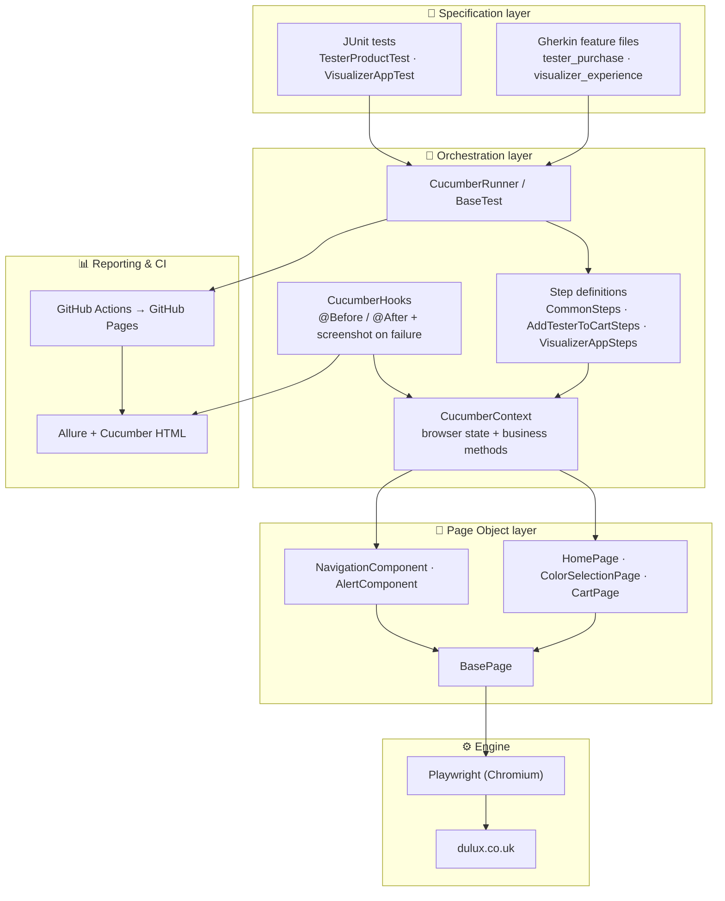

<div align="center">

# 🎭 Playwright E2E Automation Framework

### UI end-to-end test automation for [Dulux UK](https://www.dulux.co.uk) — Java · Playwright · Cucumber BDD · Allure · CI/CD

[](https://github.com/magdaU/playwright-e2e-test-dulux/actions/workflows/e2e-tests.yml)
[](https://magdau.github.io/playwright-e2e-test-dulux/)
[](https://openjdk.org/projects/jdk/21/)
[](https://maven.apache.org/)
[](https://playwright.dev/java/)
[](https://junit.org/junit5/)
[](https://cucumber.io/)
[](LICENSE)

</div>

<!--
  HERO IMAGE
  Replace the line below with a banner once you have one
  (e.g. an Allure dashboard screenshot or a custom title card).
  Save it as docs/images/hero.png and it will render here.
-->
<div align="center">
  
</div>

---

## 📖 Overview

A production-style **UI end-to-end test automation framework** that exercises real customer journeys on the [Dulux UK](https://www.dulux.co.uk) website — buying a colour tester and launching the Visualizer app — across **desktop and mobile viewports**.

The project is built the way a commercial QA framework is built: a clean **Page Object Model**, a **Cucumber BDD** layer that describes behaviour in business language, **AssertJ** assertions kept out of the page layer, **Allure** reporting with screenshots on failure, and a **GitHub Actions** pipeline that runs the smoke suite on every push and publishes a live report to GitHub Pages.

> **Why Dulux?** It's a real, public, JavaScript-heavy e-commerce site — cookie banners, dropdown navigation, new-tab flows and responsive layouts — which makes it a realistic target for demonstrating robust, non-flaky automation.

---

## ✨ Key Features

- 🧱 **Page Object Model + Component Objects** — pages and reusable UI components (`NavigationComponent`, `AlertComponent`) each extend a shared `BasePage`, eliminating duplication.
- 🥒 **Cucumber BDD layer** — scenarios written in plain-language Gherkin, with `@smoke` / `@regression` / `@desktop` / `@mobile` tags runnable by expression.
- 📱 **Cross-viewport coverage** — the same journeys run at desktop (1920×1080) and mobile (375×667) resolutions.
- 🔌 **Dependency Injection** — PicoContainer shares a single `CucumberContext` (browser state + business helpers) across all step definitions.
- ✅ **Assertions in the test layer only** — page objects never assert; AssertJ fluent assertions live in tests/steps.
- 📊 **Allure + Cucumber HTML reporting** — screenshot auto-attached to every failed scenario.
- 🚀 **CI/CD with GitHub Actions** — smoke suite on every push/PR, artifacts uploaded, live report deployed to GitHub Pages.

---

## 🏛 Architecture

A layered framework: business-readable Gherkin and JUnit tests sit on top, the page layer talks to Playwright, and reporting/CI wrap the whole thing.



### Design patterns

- **Page Object Model (POM)** — each page is a class extending `BasePage` (shared `Page` field).
- **Component Objects** — reusable UI parts separated from full-page objects.
- **Base classes** — `BasePage` and `BaseTest` remove duplicated setup/teardown.
- **BDD (Given/When/Then)** — Cucumber scenarios describe behaviour, not implementation.
- **Dependency Injection** — PicoContainer injects `CucumberContext` into every step class.

---

## 🗂 Project Structure

```
src/
└── test/
    ├── java/
    │   └── com/github/magdalena/
    │       ├── cucumber/
    │       │   ├── steps/
    │       │   │   ├── CommonSteps.java           # Reusable Given/When steps (shared across features)
    │       │   │   ├── AddTesterToCartSteps.java  # Then steps for tester purchase
    │       │   │   └── VisualizerAppSteps.java    # Then steps for visualizer experience
    │       │   ├── CucumberContext.java           # Shared browser state + high-level business methods
    │       │   ├── CucumberHooks.java             # @Before / @After – screenshot on failure
    │       │   └── CucumberRunner.java            # JUnit Platform suite runner with Allure plugin
    │       ├── page/
    │       │   ├── BasePage.java                  # Shared Page field for all page/component objects
    │       │   ├── component/
    │       │   │   ├── AlertComponent.java        # Handles alert/banner interactions
    │       │   │   └── NavigationComponent.java   # Top nav, hamburger menu, search
    │       │   └── pom/
    │       │       ├── CartPage.java              # Shopping cart page actions
    │       │       ├── ColorSelectionPage.java    # Colour picker & tester purchase
    │       │       └── HomePage.java              # Home page navigation & cookies
    │       ├── support/
    │       │   └── PlaywrightConfig.java          # Reads headless flag from system property / env var
    │       └── tests/
    │           ├── BaseTest.java                  # Shared JUnit setup / teardown
    │           ├── purchase/
    │           │   └── TesterProductTest.java     # Add colour tester to cart (desktop & mobile)
    │           └── visualizer/
    │               └── VisualizerAppTest.java     # Visualizer app new-tab flow (desktop & mobile)
    └── resources/
        └── features/
            ├── tester_purchase.feature            # BDD scenarios for TC-01 / TC-02
            └── visualizer_experience.feature      # BDD scenarios for TC-03 / TC-04
```

---

## 🧰 Tech Stack

| Tool | Version | Purpose |
|---|---|---|
| Java | 21 | Language |
| Playwright | 1.50.0 | Browser automation |
| JUnit Jupiter | 5.11.1 | Test runner |
| Cucumber | 7.18.1 | BDD layer (Gherkin feature files) |
| PicoContainer | – | Dependency injection for Cucumber |
| AssertJ | 3.24.2 | Fluent assertions |
| Allure | 2.29.1 | Test reporting |
| Maven | 3.x | Build & dependency management |
| GitHub Actions | – | CI/CD pipeline |

---

## 🚀 Getting Started

### Prerequisites
- **Java 21+**
- **Maven 3.x**
- Internet access (tests run against `dulux.co.uk`)

### Clone & install browsers
```bash
git clone https://github.com/magdaU/playwright-e2e-test-dulux.git
cd playwright-e2e-test-dulux

# install the Playwright browser binaries (Chromium)
mvn exec:java -Dexec.mainClass=com.microsoft.playwright.CLI -Dexec.args="install --with-deps chromium"
```

### Run the suite
```bash
mvn test
```

That's it — `mvn test` runs the JUnit tests and the full Cucumber suite.

---

## ▶️ Running Tests

### Test cases covered

| ID | Scenario | Viewport | Expected result |
|---|---|---|---|
| **TC-01** | Add colour tester to cart | 🖥️ Desktop | Cart contains 1× Dulux Colour Tester – *Gentle Lavender* |
| **TC-02** | Add colour tester to cart | 📱 Mobile | Cart contains 1× Dulux Colour Tester – *Gentle Lavender* |
| **TC-03** | Open Visualizer App | 🖥️ Desktop | Visualizer App opens in a **new tab** |
| **TC-04** | Open Visualizer App | 📱 Mobile | Error message shown – app **not supported** on mobile |

### Common commands

```bash
# all tests (JUnit + Cucumber)
mvn test

# only the Cucumber suite
mvn test -Dtest=CucumberRunner

# by tag
mvn test -Dtest=CucumberRunner "-Dcucumber.filter.tags=@smoke"
mvn test -Dtest=CucumberRunner "-Dcucumber.filter.tags=@regression"
mvn test -Dtest=CucumberRunner "-Dcucumber.filter.tags=@desktop"
mvn test -Dtest=CucumberRunner "-Dcucumber.filter.tags=@smoke and @desktop"

# a single JUnit class
mvn test -Dtest=TesterProductTest
mvn test -Dtest=VisualizerAppTest

# headless (used by CI)
mvn test -Dheadless=true
```

> **Headed vs headless:** tests run **headed** by default (`headless=false`). Pass `-Dheadless=true` or set `HEADLESS=true` to run without a browser window.

### Tags

| Tag | Meaning |
|---|---|
| `@smoke` | Fast critical path – runs on every push |
| `@regression` | Full regression suite |
| `@desktop` | Scenarios using the 1920×1080 viewport |
| `@mobile` | Scenarios using the 375×667 viewport |
| `@purchase` | Tester purchase feature |
| `@visualizer` | Visualizer experience feature |

### Example feature file

```gherkin
@purchase @regression
Feature: Purchase a colour tester

  @smoke @desktop
  Scenario: Desktop customer adds a tester from the colour finder
    Given a desktop customer starts with an empty basket
    When the customer browses to shade "Gentle Lavender" from colour family "Violet"
    And the customer adds a tester to the basket
    Then the basket contains 1 item
    And the basket includes tester "Dulux Colour Tester" for shade "Gentle Lavender"
```

---

## 📊 Reports

Two reports are produced on every run, plus a screenshot attached to any failing scenario.

### 🌐 Live Allure report (GitHub Pages)

After every push to `main`, the Allure report is published to:

**➡️ https://magdau.github.io/playwright-e2e-test-dulux/**

<div align="center">
  
  <br><em>Allure — scenarios, steps and durations</em>
</div>

### 🥒 Cucumber HTML report

A standalone HTML report is also generated on every run at `target/cucumber-reports/report.html`.

### Generate locally

```bash
mvn test                # run tests → writes target/allure-results
mvn allure:report       # static HTML → target/site/allure-maven-plugin/
mvn allure:serve        # OR serve the live report in the browser
```

**What's recorded:** passed / failed / skipped scenarios, per-step durations, and a full-page screenshot attached to every failed scenario (visible in the Allure timeline).

> 📸 *The report screenshots above live in `docs/images/`. See `docs/images/README.md` for exactly which views to capture and how to regenerate them.*

> **One-time GitHub Pages setup:** Settings → Pages → Source **Deploy from a branch** → Branch **`gh-pages` / (root)** → Save. The `gh-pages` branch is created automatically after the first successful CI run.

---

## ⚙️ CI/CD

The pipeline is defined in [`.github/workflows/e2e-tests.yml`](.github/workflows/e2e-tests.yml).

### When it runs

| Trigger | Default tag |
|---|---|
| Push to `main`, `feature/**` or `fix/**` | `@smoke` |
| Pull Request to `main` | `@smoke` |
| Manual (`workflow_dispatch`) | configurable tag expression |

> **Why `fix/**`?** Without this pattern, branches named `fix/something` are silently skipped by CI — pushes land with no feedback until a PR is opened. Adding `fix/**` alongside `feature/**` ensures the smoke suite runs on every active branch.

### Pipeline steps

1. Checkout + set up **Temurin JDK 21** (Maven cache).
2. Install the **Playwright Chromium** browser.
3. Run the smoke suite headless (`-Dheadless=true`).
4. Generate the **Allure** report.
5. Upload artifacts (`cucumber-reports`, `allure-results`).
6. Publish the report to **GitHub Pages** (only on `main`).

### Run manually with a custom tag

**Actions** → **E2E Tests** → **Run workflow** → enter a `cucumber_tags` expression (e.g. `@regression`, `@smoke and @desktop`) → **Run workflow**.

---

## 👉 Future Improvements

**Done:**

- ✅ Extract duplicated `tearDown` / `setupMobile|Desktop` / `createSetup` into `BaseTest`
- ✅ Adopt the **Page Object Pattern** with inheritance via `BasePage`
- ✅ Remove assertions from page objects — all assertions now live in the test layer
- ✅ Introduce **AssertJ** for readable value/string assertions
- ✅ Add a **Cucumber BDD** layer (Cucumber 7 + PicoContainer DI, shared `CucumberContext`)
- ✅ Add `@smoke` / `@regression` tagging, runnable by expression
- ✅ Add **Allure** reporting with screenshot-on-failure, published to GitHub Pages
- ✅ Set up **GitHub Actions** CI (smoke on every push/PR, artifacts uploaded)
- ✅ Extend CI triggers to `fix/**` branches


---

## 👩‍💻 Author

**Magdalena Ukleja**

[](https://github.com/magdaU)

QA Automation Engineer — Java · Playwright · Cucumber BDD · CI/CD.
